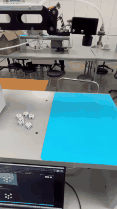
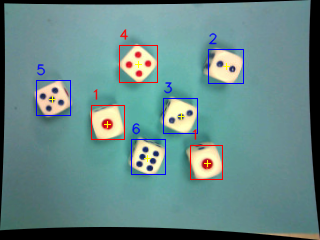
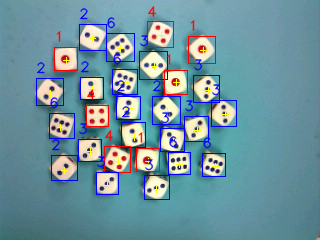
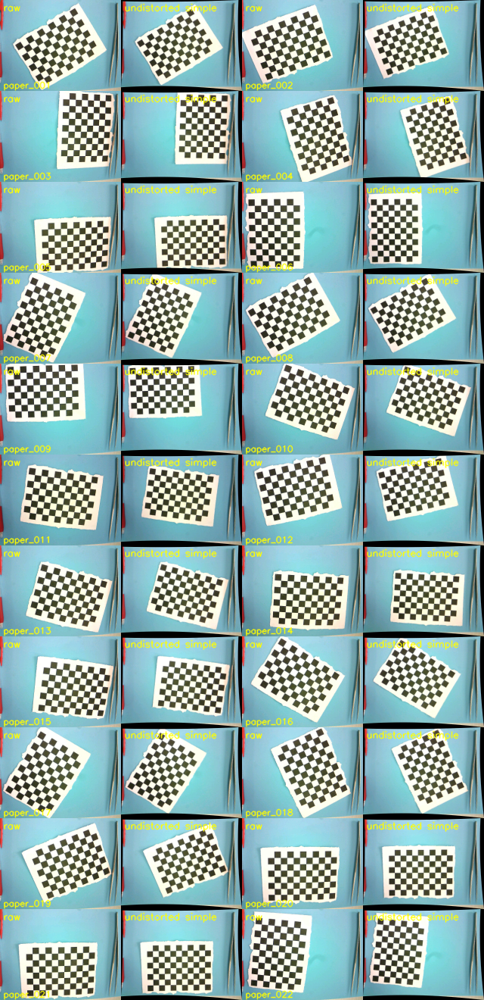
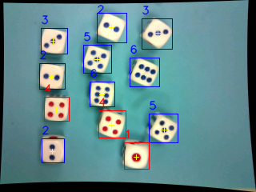
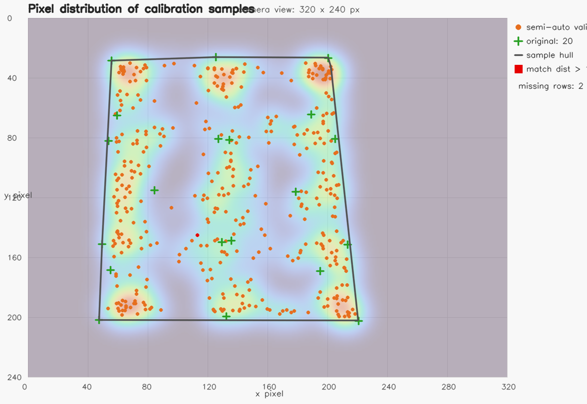

# Dice Detection and Auto Stacking with OpenMV and OpenCV

Open-source repository: <https://github.com/AlexDrives/Dice-detection-and-auto-stacking-with-OpenMV-and-OpenCV>

This project implements a complete dice recognition and robotic stacking pipeline. OpenMV is used for image capture, while the PC side uses OpenCV for camera undistortion, dice segmentation, pip recognition, center localization, pixel-to-robot calibration, and serial command generation for a suction-based robotic arm.

The calibration and final stacking demonstration were performed on **Robotic Arm No. 5**. If the camera pose, table height, suction tool, or robotic arm changes, the pixel-to-world calibration must be collected again.

## Demo



In the final demonstration, the system recognized, picked, and stacked **6 dice in 26 seconds**.

## Key Results

- Single-frame batch recognition: **27 dice coordinates and values**.
- Pixel-to-world calibration: **418 semi-automatic calibration points** plus **20 original manual points**.
- Best calibration model: Homography + quadratic residual correction.
- Validation error: **0.740 mm mean error**, **0.970 mm RMSE**.
- Camera working height above the dice plane: approximately **224.2 mm**.

## Visual Pipeline

### 1. Dice Detection and Pip Recognition

The OpenCV pipeline segments bright dice bodies, extracts pips from connected components or color masks, classifies pip geometry, and outputs dice values with grasp-friendly pip centers.



### 2. Dense Multi-Dice Recognition

The same pipeline can process densely placed dice in one frame. The example below contains 27 recognized dice.



### 3. Camera Undistortion

Checkerboard images are used to estimate camera intrinsics. Images are undistorted before segmentation and coordinate conversion.



### 4. Semi-Automatic Calibration

Semi-automatic data collection expands the calibration coverage and validates the mapping from image pixels to robotic-arm world coordinates.





## Repository Structure

```text
.
├── pc_openmv_capture_once.py          # Trigger OpenMV capture and pull JPG files
├── pc_openmv_serial_pull.py           # Pull existing images from OpenMV over serial REPL
├── pc_dice_detect.py                  # OpenCV dice detection, value recognition, center extraction
├── camera_undistort.py                # Camera intrinsic loading and image undistortion
├── validate_calibration_models.py     # Calibration model validation
├── dice_stack_pipeline.py             # Detection JSON/CSV to world coordinates and stack commands
├── dice_stack_pipeline_config.yaml    # Robotic-arm and stacking parameters
├── calibrations/                      # Camera and pixel-to-world calibration files
├── coords/                            # Calibration points and world-coordinate samples
├── results/                           # Selected detection and validation results
├── notebooks/                         # Development/debug notebooks in upload_package
├── assets/                            # Demo GIF/video and README figures
└── upload_package/                    # Reproducible package for submission
```

## Installation

Python 3.10 or newer is recommended.

```powershell
python -m pip install -r requirements.txt
```

The OpenCV pipeline uses `opencv-python`, `numpy`, `pyserial`, and `PyYAML`. `ultralytics` is only needed for the optional YOLO script; the reported results use the OpenCV pipeline.

## Quick Reproduction Without Hardware

The repository includes a saved 27-dice detection JSON. You can generate world coordinates and stacking commands without connecting OpenMV or the robotic arm:

```powershell
python dice_stack_pipeline.py `
  --input results\dice_detect_single_frame_check\frame_01.json `
  --commands-out results\stack_commands_preview.txt `
  --output-json results\stack_pipeline_preview.json
```

To rerun calibration validation:

```powershell
python validate_calibration_models.py
```

Expected validation summary:

```text
homography_quadratic_residual: mean=0.740 mm, rmse=0.970 mm, p95=1.725 mm
```

## Capturing New Images with OpenMV

Connect the OpenMV board and replace `COM17` with the actual serial port:

```powershell
python pc_openmv_capture_once.py --port COM17 --expected 1
```

Then run dice detection on a captured image or folder:

```powershell
python pc_dice_detect.py `
  --input captures\openmv_YYYYMMDD_HHMMSS `
  --save-dir results\dice_detect_new `
  --body-threshold 180 `
  --save-binary `
  --intrinsics calibrations\camera_intrinsics_paper_9p63_simple.json
```

The detector outputs annotated images, binary masks, and JSON files. The JSON file can then be passed to `dice_stack_pipeline.py`.

## Sending Commands to the Robotic Arm

First generate commands without sending them. After confirming the command sequence and hardware safety, add `--send`:

```powershell
python dice_stack_pipeline.py `
  --input results\dice_detect_single_frame_check\frame_01.json `
  --send --port COM15
```

The serial port and motion parameters must match the local controller. The provided calibration is for **Robotic Arm No. 5** only.

## Notebooks and Submission Package

`upload_package/` contains a teacher-friendly reproducible package:

- source code and configs,
- calibration files,
- selected result examples,
- demo assets,
- report PDF/TEX,
- notebooks for capture, detection, coordinate conversion, calibration, and serial command debugging.

See `upload_package/README.md` for the full reproduction guide.

## License

This project is released under the MIT License.
